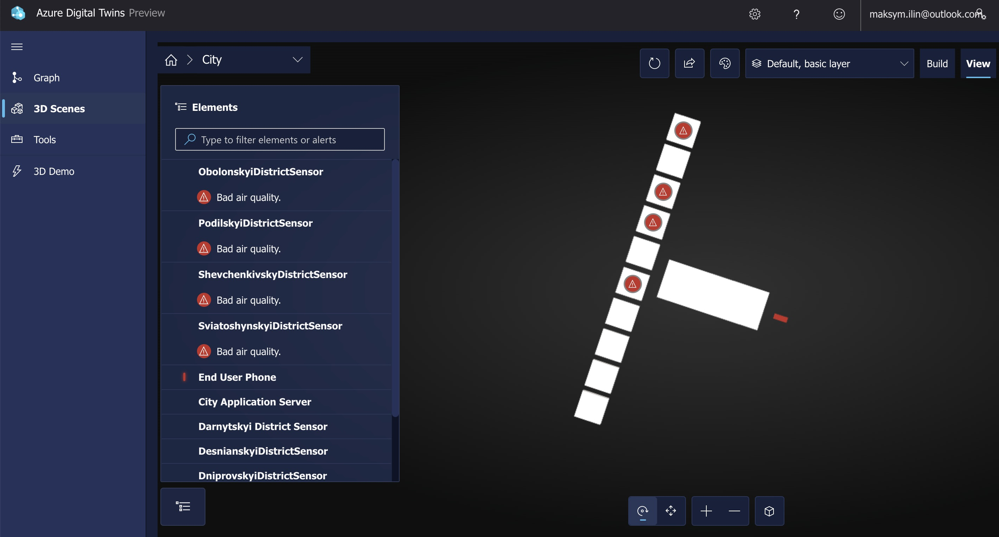

# Air Quality Monitoring System

This repository implements an Air Quality Monitoring System that tracks air pollution data through backend processes and visualizes this data both as digital maps and within a 3D model environment using Azure Digital Twins. The system uses Azure Functions for automating data retrieval, pollution analysis, and sending notifications concerning air quality dangers to end users.

## Project Overview

The project consists of two main parts due to the limitations of Azure Digital Twins:

1. **3D Digital Twin Visualization**: This part utilizes Azure Digital Twins 3D Scene to visualize the interaction between 10 air pollution sensors (representing one sensor for each district of the city), the city app server, and the end-user phone. It comprises 12 entities: 10 sensors, the server, and the end-user phone.

2. **2D Analytical Visualization**: This part includes a visualization based on the Azure Maps service, featuring charts that represent historical data and the current air state for the 10 districts.

A video presentation showcasing both parts can be found in the [docs/videos](docs/videos) directory.

## Data Sources

The project utilizes the following data sources:

- **Air Quality API**: The [Air Quality API](https://rapidapi.com/weatherbit/api/air-quality) provides a 3-day air quality forecast, current air quality, pollution levels, and daily historical air quality values for anywhere in the world. It updates once an hour.

## Database

MongoDB is used as the database for storing historical air quality data. The CRUD operations are implemented in the `database.py` file.

## Backend Logic

Azure Functions are used to handle the backend logic for the project. They perform the following tasks:

1. Update data in the Digital Twins each hour due to the API limitation.
2. Check if the pollution threshold is exceeded and, if so, alert the server with an `AlertLevel` and `AlertMessage`.

For testing purposes, a dummy values generator is created. It uses a random generator to generate values using Azure Functions once every 10 seconds.

## Project Structure

```
.
|____server.py
|____DTDL_models
| |____CoordinatesModel.json
| |____CityApp.json
| |____Phone.json
| |____DistrictSensor.json
|____database.py
|____docs
| |____screenshots
| | |____01.jpeg
| | |____02.jpeg
| | |____03.jpeg
| | |____04.jpeg
| |____videos
| | |____Part 1 - 3D Visualisation.mov
| | |____Part 2 - 2D Analytics Module.mov
|____README.md
|____.gitignore
|____azure_functions
| |____host.json
| |____requirements.txt
| |____pyvenv.cfg
| |____function_app.py
|____templates
| |____map.html
|____3D_model
| |____general_scene.gltf
```

## Features

- **Live Air Quality Mapping**: Visualization of current air quality data on a digital map.
- **3D Visualization**: Uses Azure Digital Twins to model and visualize air quality in a 3D interactive environment.
- **Automated Data Handling**: Azure Functions automatically fetch air quality data, analyze pollution levels, and notify users if thresholds are exceeded.

## Getting Started

### Prerequisites

- Python 3.8+
- Azure account with an active subscription
- Azure CLI or Azure portal access
- Node.js and npm (for any frontend package management)

### Installation

1. **Clone the repository:**

   ```
   git clone https://github.com/yourgithubusername/air-quality-monitoring.git
   cd air-quality-monitoring
   ```

2. Set up a virtual environment (optional but recommended):

   ```
   python -m venv venv
   source venv/bin/activate # On Windows use `.\venv\Scripts\activate`
   ```

3. Install requirements:

   ```
   pip install -r azure_functions/requirements.txt
   ```

4. Local settings for Azure Functions:

   Navigate to the `azure_functions` directory and rename the `local.settings.json.example` to `local.settings.json`, then update it with your Azure credentials.

5. Run the server:

   ```
   python server.py
   ```

## Usage

To see the air quality mapping:

- Open your web browser and navigate to `http://localhost:<port>/map.html` (replace `<port>` with the port number on which `server.py` is running, usually printed to the console on startup).

To interact with the 3D digital twins model:

- Ensure your Azure Digital Twins instance is properly set up and that the `general_scene.gltf` is correctly configured in the Azure Digital Twins Explorer.

### Interacting with Azure Functions

Azure Functions are set to trigger at scheduled intervals, but you can trigger them manually from the Azure portal for testing purposes.

## Screenshots



Description: This screenshot demonstrates the 3D models that represent Digital Twins of 10 air sensors, the City App Server, and the end-user phone.


Description: This screenshot demonstrates the Twin Graph from the Azure Digital Twin Service.


Description: This screenshot demonstrates the Model Graph from the Azure Digital Twin Service.


Description: This screenshot demonstrates the air quality map rendered from `map.html`.

## Final Presentation

For a comprehensive overview, including the scope of work, please see [final project presentation](https://docs.google.com/presentation/d/1nRTD9RVssoOtlGSgyX_Dwp-qhCw_sd8cUWrZeDK_aGY/edit?usp=sharing).
All accompanying documents, such as the technical task, the report and the report presentation can be found in [docs](docs).
